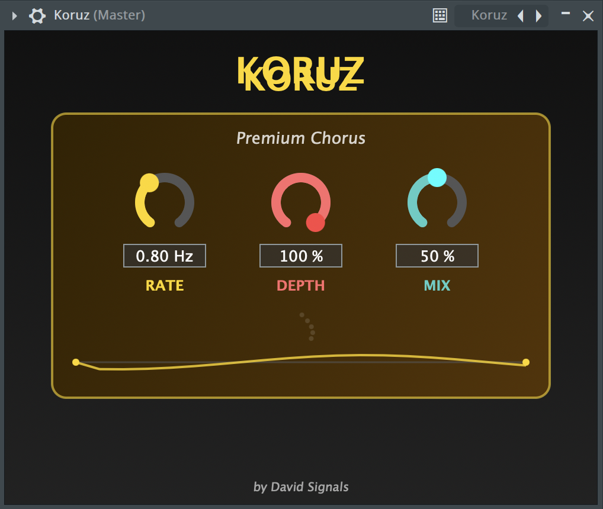
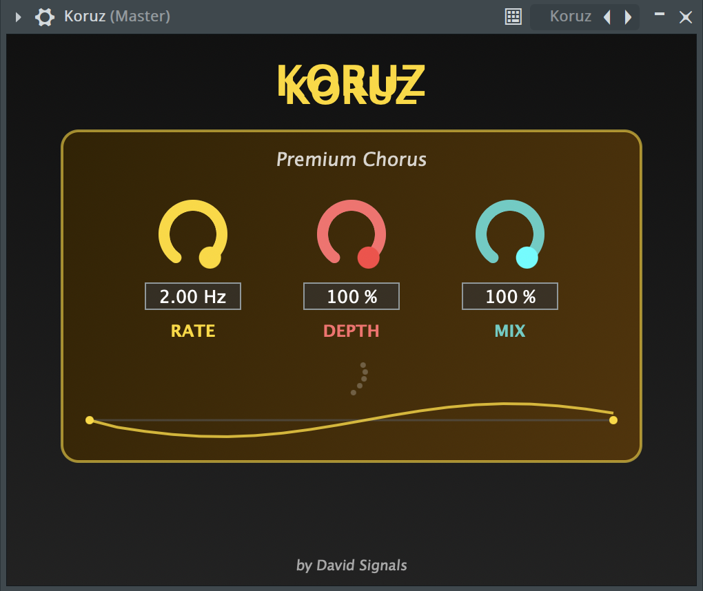

# Koruz - Premium Analog Chorus Plugin


<div align="center">
  
</div>

## 🎵 Features

- **Vintage-Inspired Chorus**: Authentic analog chorus emulation
- **Real-time Visualization**: Animated string that responds to audio parameters
- **Professional UI**: Modern dark theme with gold accents
- **Zero Latency**: Optimized for real-time performance
- **Multi-Format**: VST3, AU, and Standalone support

## 🎛️ Controls

| Parameter | Range | Description |
|-----------|-------|-------------|
| **Rate** | 0.1 - 2.0 Hz | LFO speed control |
| **Depth** | 0 - 100% | Modulation intensity |
| **Mix** | 0 - 100% | Dry/Wet balance |

## 🖼️ Screenshots

| Default Settings | High Depth | Maximum Modulation |
|------------------|------------|-------------------|
|  |  |  |

## 🛠️ Development

### Project Structure

Koruz/
├── Source/
│ ├── PluginProcessor.h/cpp # Audio processing engine
│ ├── PluginEditor.h/cpp # User interface
│ └── resources/ # UI assets (if any)
├── Builds/ # Build outputs (gitignored)
├── Koruz.jucer # JUCE project file
├── CMakeLists.txt # CMake configuration
├── README.md # This file
├── LICENSE # MIT License
└── screenshots/ # Plugin screenshots

### Technical Details
- **Framework**: JUCE 8.0.9
- **Language**: C++17
- **Platform**: macOS 12.0+
- **DSP Algorithm**: Time-based modulation with cubic interpolation
- **UI Framework**: JUCE Graphics with custom animations

### Building from Source

```bash
# Clone the repository
git clone https://github.com/davidsignals/koruz.git
cd koruz

# Generate Xcode project using CMake
cmake -B Build -G Xcode

# Open in Xcode
open Build/Koruz.xcodeproj

# Or build from command line
cmake --build Build --config Release

## 📦 Installation
For End Users
Download the latest release from the Releases page

Copy the .vst3 file to /Library/Audio/Plug-Ins/VST3/

Copy the .component file to /Library/Audio/Plug-Ins/Components/ (for AU)

Rescan plugins in your DAW

## 🔧 Supported DAWs
✅ Logic Pro X

✅ Ableton Live

✅ FL Studio

✅ Pro Tools (via AAX wrapper)

✅ Reaper

✅ Bitwig Studio

## 🤝 Contributing
Contributions are welcome! Please follow these steps:

Fork the repository

Create a feature branch (git checkout -b feature/AmazingFeature)

Commit your changes (git commit -m 'Add some AmazingFeature')

Push to the branch (git push origin feature/AmazingFeature)

Open a Pull Request

## 📄 License
This project is licensed under the MIT License - see the LICENSE file for details.

## 👨‍💻 Author
David Signals

GitHub: @davidsignalsss

Email: davrxo@gmail.com
<div align="center"> <br> <em>Built with passion for music production</em> <br> <sub>Using the incredible JUCE framework</sub> </div> 
